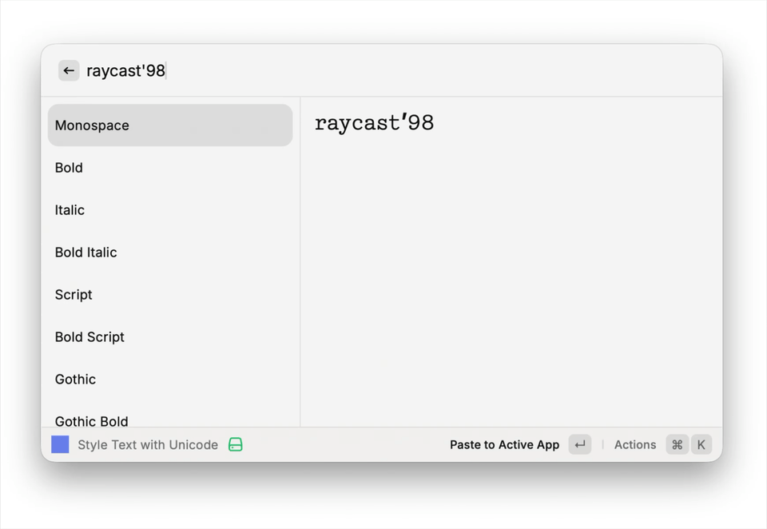

# Style Text with Unicode

Transform your text into Unicode styles like **𝐛𝐨𝐥𝐝**, *𝑖𝑡𝑎𝑙𝑖𝑐*, 𝙼𝚘𝚗𝚘𝚜𝚙𝚊𝚌𝚎, and more.



## Available Styles

| Style | Example |
|-------|---------|
| **Bold** | 𝐇𝐞𝐥𝐥𝐨 𝐖𝐨𝐫𝐥𝐝 |
| **Italic** | 𝐻𝑒𝑙𝑙𝑜 𝑊𝑜𝑟𝑙𝑑 |
| **Bold Italic** | 𝑯𝒆𝒍𝒍𝒐 𝑾𝒐𝒓𝒍𝒅 |
| **Monospace** | 𝙷𝚎𝚕𝚕𝚘 𝚆𝚘𝚛𝚕𝚍 |
| **Script** | ℋℯ𝓁𝓁ℴ 𝒲ℴ𝓇𝓁𝒹 |
| **Bold Script** | 𝓗𝓮𝓵𝓵𝓸 𝓦𝓸𝓻𝓵𝓭 |
| **Gothic** | ℌ𝔢𝔩𝔩𝔬 𝔚𝔬𝔯𝔩𝔡 |
| **Gothic Bold** | 𝕳𝖊𝖑𝖑𝖔 𝖂𝖔𝖗𝖑𝖉 |
| **Double-struck** | ℍ𝕖𝕝𝕝𝕠 𝕎𝕠𝕣𝕝𝕕 |
| **Sans-serif** | 𝖧𝖾𝗅𝗅𝗈 𝖶𝗈𝗋𝗅𝖽 |
| **Bold Sans** | 𝗛𝗲𝗹𝗹𝗼 𝗪𝗼𝗿𝗹𝗱 |
| **Italic Sans** | 𝘏𝘦𝘭𝘭𝘰 𝘞𝘰𝘳𝘭𝘥 |
| **Bold Italic Sans** | 𝙃𝙚𝙡𝙡𝙤 𝙒𝙤𝙧𝙡𝙙 |
| **Parenthesis** | ⒣⒠⒧⒧⒪ ⒲⒪⒭⒧⒟ |
| **Circled** | Ⓗⓔⓛⓛⓞ Ⓦⓞⓡⓛⓓ |
| **Circled Negative** | 🅗🅔🅛🅛🅞 🅦🅞🅡🅛🅓 |
| **Squared** | 🄷🄴🄻🄻🄾 🅆🄾🅁🄻🄳 |
| **Squared Negative** | 🅷🅴🅻🅻🅾 🆆🅾🆁🅻🅳 |
| **Fullwidth** | Ｈｅｌｌｏ Ｗｏｒｌｄ |

## Running

### From Raycast Store
Search for "Style Text with Unicode" in Raycast Store.

### Development
```bash
# Install dependencies
pnpm install

# Start development mode
pnpm run dev
```

## How It Works

Uses Unicode's Mathematical Alphanumeric Symbols block (U+1D400–U+1D7FF) to create styled text that works anywhere without special fonts or formatting.

## Credits

Based on [toUnicodeVariant](https://github.com/davidkonrad/toUnicodeVariant) by David Konrad.

## License

MIT
